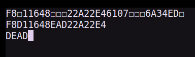
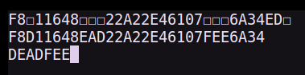
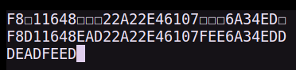
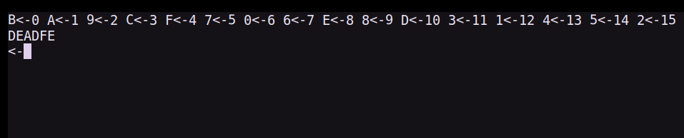
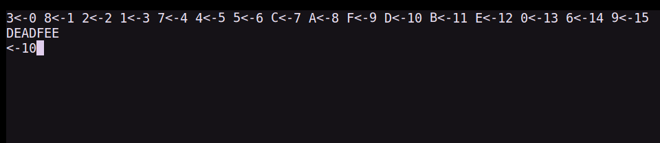
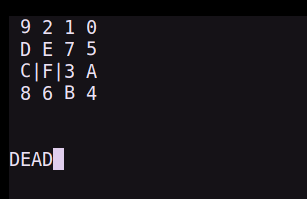
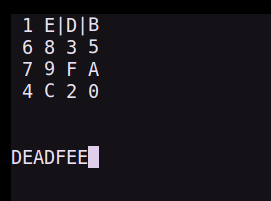

# Secure Password Entry With Compromised Input Systems


## Introduction

This repository contains the prototype developed for the course CS858 (Fall 2024) at Uwaterloo. It implements three different ways to enable secure password entry using a system compromised by a keylogger.

## Working

The presence of python3 and the `curses` module is a prerequisite. The tool can be run via the following command at the root of the repository:

`python ./main.py [arg]`

|arg|tool|
|---|----|
|1|shuffled string|
|2|iterated choice|
|3|state machine|

The values assigned to these variables (found in `main.py`) can be changed for custom tests:

```
ALPHABET = "0123456789ABCDEF"
PASSWORD = "DEADFEED"
MIN_ENTROPY = 32
```

The default alphabet is the set of all valid hexadecimal digits.

The prototype also has a simple keylogger that captures all inputs when the script is being run. The data gathered by the keylogger is printed to the console after the script is terminated (either by successful entry of the password or via an interrupt triggered by `ctrl+C`). The data is of the form:

```
[
	(<key>,<Unix_epoch>),
	(<key>,<Unix_epoch>),
	...
]
```

The time of each key being pressed helps implement timing attacks on the system.

The state transitions for the state machine are triggerd using the `WSAD` keys.

## Screenshots

### Shuffled String







### Iterated Choice





### State Machine






